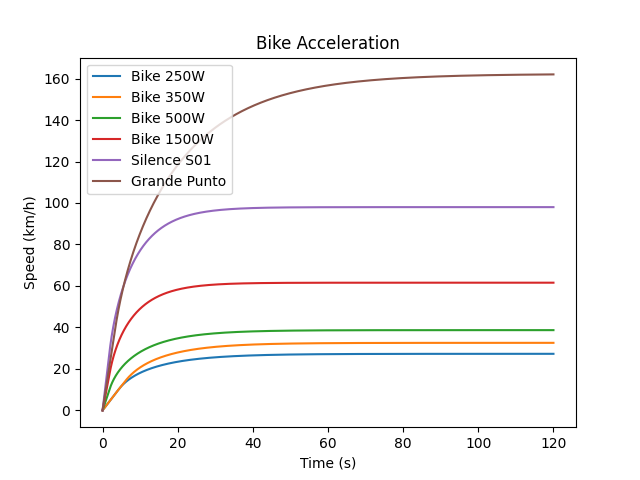
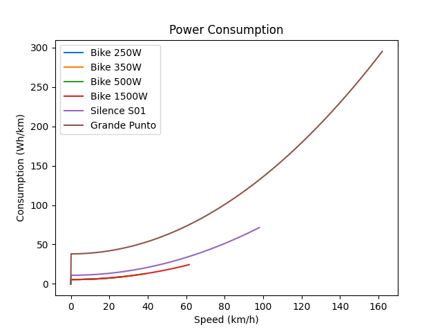

## Simulations

The  power consumption shown does not account for drivetrain, motor, inverter and battery inefficiencies.
It is only the energy required to win drag and rolling resistance for a given distance travelled (1 km).

## Top Speeds
- Bike 250W top speed: 27 km/h
- Bike 350W top speed: 33 km/h
- Bike 500W top speed: 39 km/h
- Bike 1500W top speed: 62 km/h
- Silence S01 top speed: 98 km/h
- Grande Punto top speed: 162 km/h
